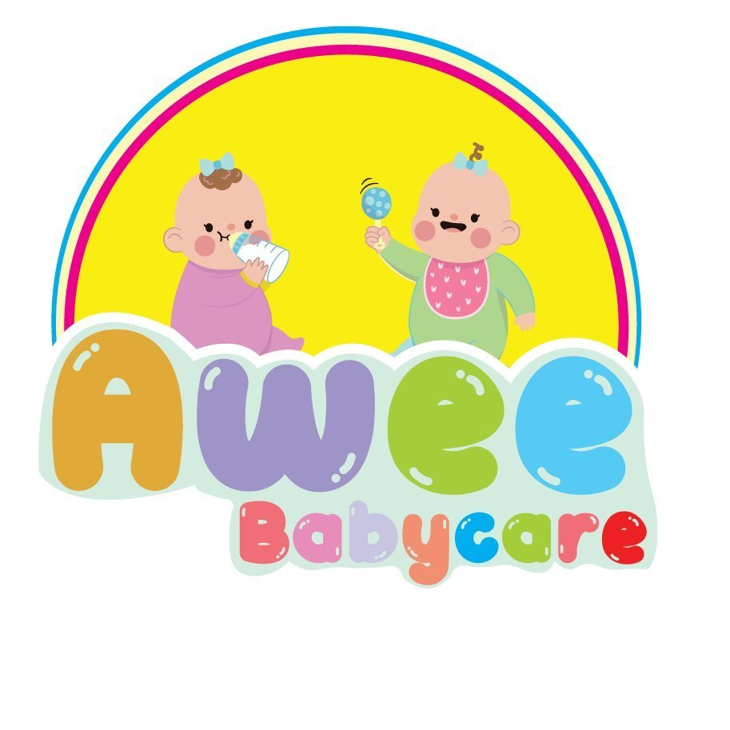

<div align="center">
  
  <h1>Awee Babycare - Clinic Management System</h1>
  <p>Sistem manajemen klinik untuk operasional Awee Babycare.</p>
</div>

---

## Deskripsi Proyek

Awee Babycare adalah aplikasi berbasis web yang dirancang khusus untuk mempermudah manajemen operasional klinik perawatan ibu dan bayi. Aplikasi ini mencakup fitur pengelolaan data pasien, penjadwalan terapis, rekap medis/layanan, laporan keuangan otomatis, dan manajemen master data (terapis & layanan).

Aplikasi ini dibangun menggunakan arsitektur pemisahan _Frontend_ dan _Backend_:

- **Frontend**: React.js (Vite), TypeScript, TailwindCSS
- **Backend**: PHP Native (PDO)
- **Database**: MySQL (XAMPP)

---

## Fitur Utama

1. **Dashboard Admin**: Ringkasan performa klinik (KPI), estimasi omzet, jadwal terapis realtime, dan sistem peringatan (warning system) jika ada anomali pembayaran.
2. **Manajemen Master Data**: Pengelolaan data Layanan (Services) beserta harganya dan data Terapis secara dinamis.
3. **Reservasir**: Form reservasi lengkap dari biodata anak, pemetaan terapis bertugas, jadwal, hingga penambahan _multi-treatment_.
4. **Laporan Keuangan & Analitik**: Menampilkan perbandingan omzet harian/bulanan/tahunan secara visual dengan grafik, laporan komisi terapis otomatis, tren status reservasi, dan daftar layanan terlaris.

---

## Persyaratan Sistem (Prerequisites)

Sebelum menjalankan proyek ini, pastikan sistem Anda telah terinstal perangkat lunak berikut:

1. **XAMPP** atau **Laragon** (Untuk menjalankan Apache server dan MySQL). Disarankan menggunakan versi PHP 8+.
2. **Node.js** (Versi 18 ke atas) & **npm** (Untuk menjalankan environment Frontend React Vite).
3. **Git** (Untuk manajemen versi / clone repository).
4. Browser modern (Google Chrome, Firefox, Safari, Edge).

---

## Panduan Instalasi & Persiapan (Setup Guide)

Ikuti langkah-langkah di bawah ini untuk menjalankan aplikasi di komputer lokal (Localhost).

### 1. Kloning Repositori (Clone Repository)

Buka terminal/Command Prompt dan arahkan ke dalam direktori web server Anda (jika XAMPP, arahkan ke `htdocs`).

```bash
cd C:\xampp\htdocs
git clone https://github.com/ilhamzainuri/awee-babycare.git
cd awee-babycare
```

### 2. Persiapan Database (Database Setup)

1. Buka aplikasi **XAMPP Control Panel** / Laragon.
2. Jalankan modul **Apache** dan **MySQL**.
3. Buka browser dan akses **phpMyAdmin** (biasanya di `http://localhost/phpmyadmin`).
4. Buat database baru dengan nama: `db_awee_babycare`.
5. Import file SQL yang telah disediakan ke dalam database tersebut. Cari file bernama `db_awee_babycare.sql` yang terletak di _root_ folder proyek ini, lalu import.

_(Pastikan konfigurasi koneksi database di file `backend/config/koneksi.php` sudah sesuai dengan kredensial MySQL Anda, biasanya `root` tanpa password)._

### 3. Persiapan Backend (PHP API)

Backend pada proyek ini tidak memerlukan instalasi tambahan. Karena Anda menyimpannya di dalam folder `htdocs`, backend secara otomatis dapat diakses melalui URL:
`http://localhost/awee-babycare/backend/api/...`

### 4. Persiapan Frontend (React Vite)

Buka terminal baru pada _root_ folder frontend proyek (`c:\xampp\htdocs\awee-babycare\frontend`), lalu jalankan:

```bash
# 1. Install semua dependencies/library frontend
npm install

# 2. Sesuaikan Environment Variable (File .env)
# Copy file .env.example menjadi .env (atau edit file .env langsung)
# Pastikan VITE_API_BASE_URL mengarah ke localhost yang benar, misal:
# VITE_API_BASE_URL=http://localhost/awee-babycare/backend/api

# 3. Jalankan server pengembangan (Development Server)
npm run dev
```

### 5. Akses Aplikasi

Setelah perintah `npm run dev` berhasil dijalankan, terminal akan memberikan URL lokal.
Secara default, Frontend dapat diakses melalui browser pada:
👉 **`http://localhost:5173/`** atau sesuai port yang diberikan oleh Vite.

---

## 📂 Struktur Direktori Utama

```
awee-babycare/
├── backend/                  # Kode sumber Backend (PHP Native)
│   ├── api/                  # Endpoint API (dashboard.php, reports.php, dll)
│   └── config/               # Konfigurasi sistem (koneksi database)
├── frontend/                 # Kode sumber Frontend (React.js)
│   ├── public/                   # Asset statis yang tidak ter-compile (icon, gambar)
│   ├── src/                      # Kode sumber Frontend (React.js)
│   ├── components/           # Komponen UI Reusable (Layout, Icon, dll)
│   ├── lib/                  # Fungsi-fungsi utility (Tailwind merge, dll)
│   ├── pages/                # Halaman aplikasi (Dashboard, MasterData, Reports, dll)
│   ├── App.tsx               # Entry point aplikasi React & Routing
│   ├── index.css             # Konfigurasi global CSS & Tailwind
│   └── main.tsx              # Root render React DOM
│   ├── package.json              # Konfigurasi project NPM & dependencies
│   └── vite.config.ts            # Konfigurasi Vite builder
├── db_awee_babycare.sql      # File Database MySQL
└── README.md                 # Dokumentasi proyek (File ini)
```

---

## Catatan Penting Saat Pengembangan

- **CORS (Cross-Origin Resource Sharing)**: Karena frontend (Vite) berjalan di port yang berbeda (misal 5173) dengan backend PHP (port 80), file PHP di backend telah dikonfigurasi header CORS agar mengizinkan request API dari Vite.
- Seluruh endpoint mengambil `VITE_API_BASE_URL` dari file `.env`. Pastikan penamaan folder pada URL sudah sesuai dengan yang ada di `htdocs`.
- **Git Commit**: Jika melakukan perubahan kode, harap selalu berikan pesan commit yang deskriptif.

---

Anggota :

1. Ilham Zainuri
2. M Hafiz Firmansyah
3. Akhmad Labib

_Dikembangkan untuk Awee Babycare._
